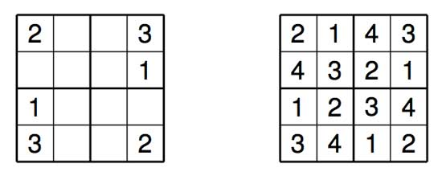

# An Assembler Solver for Mini-Sudoku's

A mini-sudoku is basically a simplified sudoku with 4x4 cells as seen in above Figure
Every column, row and 2x2 house has to contain the digits 1-4. In this case the
mini-sudoku is correctly solved.
In general these mini-sudokus are easy to solve by hand and with the computer. I wrote a recursive assembler-program that solves a given mini-sudoku.

I made the following notes before writing the program:
- The board is stored in a one-dimensional array with 16 elements
- Use a pointer to reference the given initial sudoku.
- Write an initialization-routine that copies the sudoku-problem into a new
array and then solves for the copied array.
- Write a recursive function solve. In this method a backtracking algorithm
is implemented that tries all different possible values for the empty cells
until a solution is found.
- Write a subroutine that checks if the current board is legal and use this
method in solve.
- When the correct solution is found then stop the solving-algorithm. If no
solution can be found, leave the given sudoku unchanged.
- Write a subroutine that checks if the board is full. In this case and if the
board is legal we have found a solution for the sudoku.
